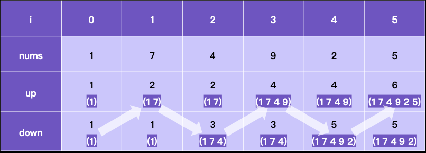

1. nums[i+1] > nums[i]
   * 假设down[i]表示的最长摆动序列的最远末尾元素下标正好为i，遇到新的升元素后, up[i+1] = down[i] + 1，
     这是因为up一定从down产生(初始除外)，并且down[i] 此时最大。
   * 假设down[i] 表示的最长摆动序列的最远未玩素下标小于i，设为j，那么nums[j:i]
   一定是递增的，因为若完全递减，远元素下标等于i,若波动，那么down[i] > down[j]。 由
   于nums[j:i] 递增，down[j:i] 一直等于down[j], 依然满足up[i+1] = down[i] + 1。
2. nums[i+1] < nums[i] ，类似第一种情况
3. nums[i+1] == nums[i]，新的元素不能用于任何序列，保持不变
