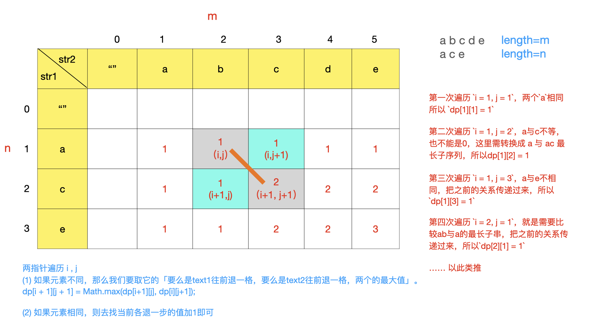
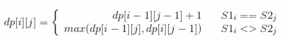

* 1、明确dp数组含义：
    * LCS 长度是 dp[i][j]
* 2、定义 base case
    * 索引为0的行和列表示空串,dp[i...][0] dp[0][j....]为0
* 3、找动态方程
    *  当S1i==S2j 时，那么就能在 S1 的前 i-1 个字符与 S2 的前 j-1 个字符最长公共子序列的基础上再加上 S1i 这个值，最长公共子序列长度加 1，即 dp[i][j] = dp[i-1][j-1] + 1。 
    *  当S1i != S2j 时，此时最长公共子序列为 S1 的前 i-1 个字符和 S2 的前 j 个字符最长公共子序列，或者 S1 的前 i 个字符和 S2 的前 j-1 个字符最长公共子序列，取它们的最大者，即 dp[i][j] = max{ dp[i-1][j], dp[i][j-1] }
#### 动态方程

