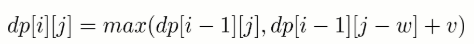
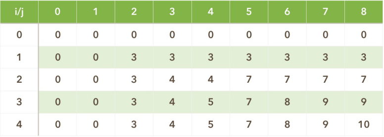

用v[i]表示物品价值，w[i]表示物品重量。定义状态dp[i][j]以j为容量为放入前i个物品(按i从小到大的顺序)的最大价值。
* 第 i 件物品没添加到背包，总体积不超过 j 的前 i 件物品的最大价值就是总体积不超过 j 的前 i-1 件物品的最大价值，dp[i][j] = dp[i-1][j]。
* 第 i 件物品添加到背包中，dp[i][j] = dp[i-1][j-w] + v。
##### 第 i 件物品可添加也可以不添加，取决于哪种情况下最大价值更大
dp[i,j]=max(dp(i-1,j)，dp(i-1,j-w(i))+v(i))

j表示背包的的重量，i表示第i个物品，
填表方式为一行一行的填，每次填写的时候取 V(i-1,j)，V(i-1,j-w(i))+v(i)中的较大值
